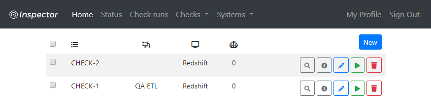
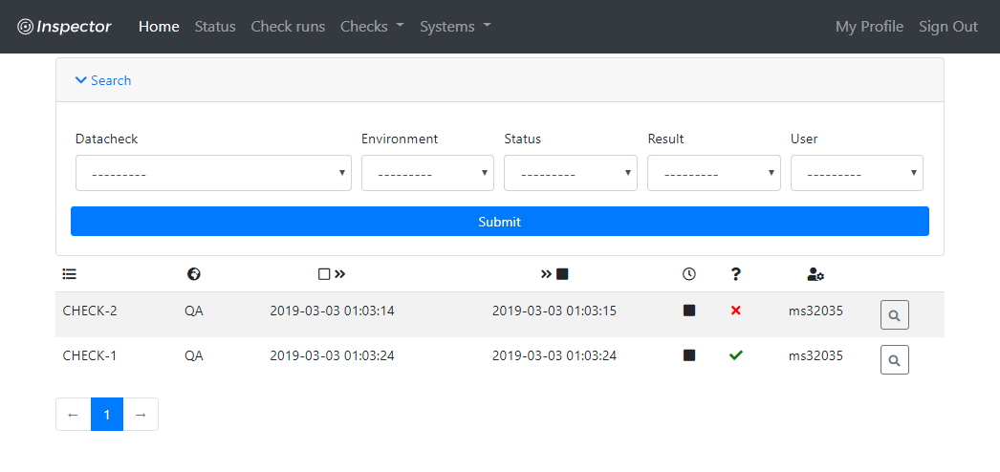

Inspector
=========

.. image:: https://img.shields.io/badge/built%20with-Cookiecutter%20Django-ff69b4.svg
     :target: https://github.com/pydanny/cookiecutter-django/
     :alt: Built with Cookiecutter Django

.. image:: http://img.shields.io/:license-Apache%202-blue.svg
     :target: http://www.apache.org/licenses/LICENSE-2.0.txt
     :alt: License

Born out of the experience that ETL pipelines never get enough testing,
Inspector was built to help with:

* managing and execution of check queries when testing ETL processes
* periodic data integrity verification in production environments
* confirming that testing has actually been done ;)

Documentation
-------------

https://yoyo-inspector.readthedocs.io/

User interface
--------------

* **Check list**

* **Check definition**

.. image:: docs/_static/check_definition.png

* **Check execution history**

Contributing
--------------

You are more than welcome to submit a PR
